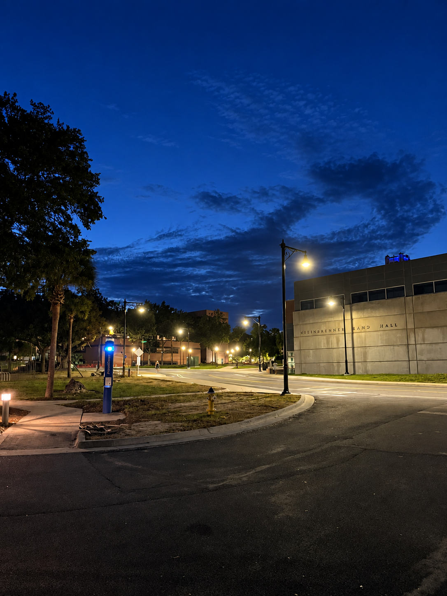

# Hi, I'm Ishan

I'm a Computer Science and Mathematics student at the University of Florida.

I work mostly around **cryptography, combinatorics, embedded systems, and algorithms**. Recently I have been interested in post quantum cryptography on small processors, hardware security, quantum annealing, and computational approaches to problems in Ramsey theory.

[Website](https://ishankumthekar.com) · [Research](https://ishankumthekar.com/research) · [Writing](https://ishankumthekar.com/writing)

 

## Research

### Polynomial Ramsey theory

I worked on polynomial van der Waerden and polynomial Rado problems at REU CAAR at the University of Maryland. We used computational search and quantum annealing techniques to find new constructions, which eventually led to two preprints.

- [Four Color Quadratic Polynomial Van der Waerden Numbers](https://www.cs.umd.edu/~gasarch/RADOSTUD/IshanPVDW4Colors.pdf)
- [Exact Rado Numbers for Polynomial Difference Equations](https://www.cs.umd.edu/~gasarch/RADOSTUD/IshanExactNonlinearRado.pdf)

### Hardware security and post quantum cryptography

At the Florida Institute for Cybersecurity Research I work on security questions around integrated circuits and cryptographic implementations.

My current work includes:

- function recovery attacks on logic locked circuits
- fault injection against masked ML-DSA implementations
- Code based Post Quantum Cryptography for intersatellite communication

More details are on my [research page](https://ishankumthekar.com/research).

## Selected Projects

### [Designing Custom RISC-V Instructions to Accelerate PQC Schemes](https://ishankumthekar.com/projects/custom-risc-v-ml-kem-instructions)

[GitHub](https://github.com/ishanrk/embedded_mlkem_bench)

I designed custom RV32 instructions for PicoRV32 to accelerate the NTT and hashing procedures used by ML-KEM.

The instructions are implemented in SystemVerilog and integrated with `mlkem-native` in C. I benchmarked ML-KEM-512, ML-KEM-768 and ML-KEM-1024 for processor cycles, FPGA LUT area and timing overhead. The best instruction reduced processor cycles by about **33%**.

### [Physical Two Factor Authentication Key](https://github.com/ishanrk/esp32p4-2fa-key)

I built a physical two factor authentication key in C on an ESP32-P4 microcontroller.

It implements FIDO2 and CTAP2 over USB HID, uses a physical button press for user presence, and uses the ESP32-P4 hardware cryptographic accelerators for P-256, AES-256-GCM and SHA-256.

I use the finished device to authenticate my own GitHub account.

## Things I like working on

**Cryptography**  
Post quantum cryptography, implementation security, side channels, fault injection, logic locking and zero knowledge protocols.

**Combinatorics**  
Ramsey theory, polynomial van der Waerden numbers and Rado numbers.

**Number theory**  
Analytic number theory, sieves and computational number theory.

**Low level systems**  
RISC-V, embedded systems, hardware acceleration and cryptographic implementations.

## Writing

I occasionally write up things I am learning or building.

- [Understanding Anthropic's Break of HAWK](https://ishankumthekar.com/writing/understanding-anthropics-hawk-break)
- [Designing Custom RISC-V Instructions to Accelerate PQC Schemes](https://ishankumthekar.com/projects/custom-risc-v-ml-kem-instructions)

More at **[ishankumthekar.com](https://ishankumthekar.com)**.

